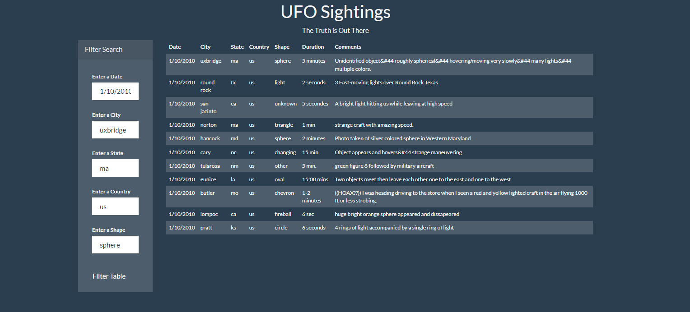

# UFOs
Introduction to Javascript
## Overview of the Analysis
The purpose of this deliverable is to update a webpage and dynamic table to provide more detail about UFO sightings by allowing users to filter for multiple criteria at the same time.  A table was built using data stored in a JavaScript array. The table is dynamic, responding to user input. This is the original table and webpage. 

## Results: Deliverable 1 (Filter by Multiple Criteria)
Table filters are added to the original JavaScript and HTML. The webpage includes five different filter search boxes on the left side of the page, which includes the Date, City, State, Country, and Shape. The results of the information entered into the filter search box will return the UFOs sightings for the exact information entered in the filter search. Someone might use this new webpage to compare their sightings with similar sightings by location and shape. 

## Summary 
### Drawbacks 
Having so many filters is not user-friendly. 

### Recommendations 
Have a drop-down box for each category so that users can select from what data is included in the table. 
Alphabetizing the results. 
